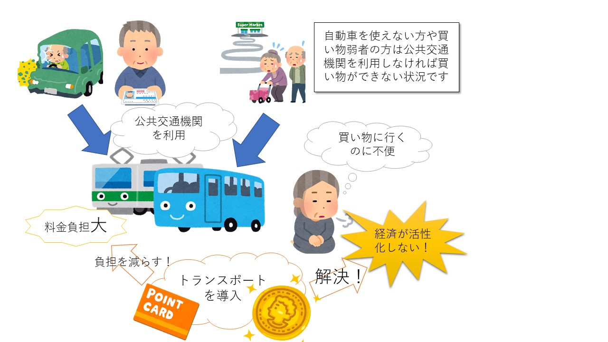
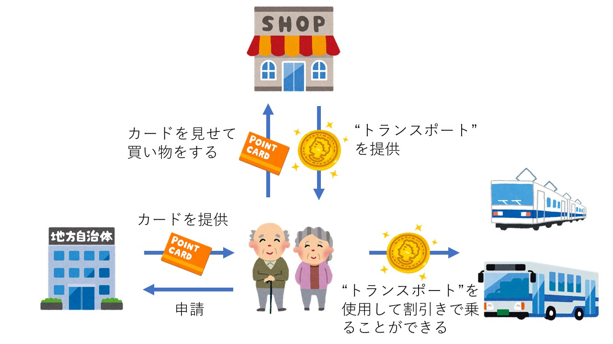

# トランスポート

## 目的（導入を検討するお店、自治体向け）
[詳しく](./mokuteki) 
免許を返納した人の移動手段や公共交通機関を使った移動を支援するために考えられました。 

---

## 作った背景
[詳しく](./haikei) 

 

高齢者による交通事故の増加などを受けて高齢者の免許返納は進んでいます。 
そんな中で公共交通機関の役割の重要です。 
高齢者でも経済的な負担が少なくバスや電車を利用できるようにしたいと考えました。 

---

## 利用法
[詳しく](./riyouhou) 
 
トランスポートを導入することで地域活性化を目指します 
・トランスポートを貯めるカードをもって地域のお店に向かいます 
・お店で買い物をするとトランスポートが貯まったらそのポイントでバスや電車公共交通機関に乗ることができます。 

